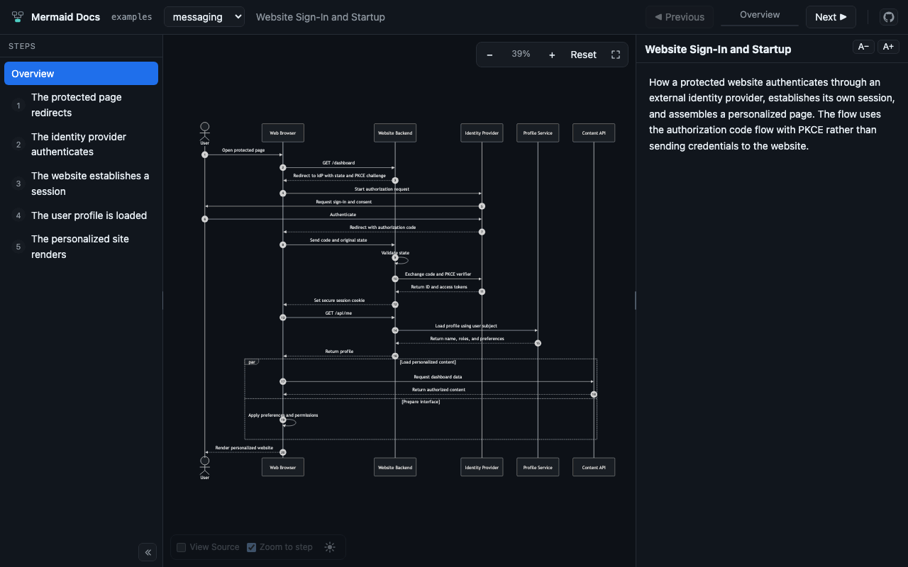
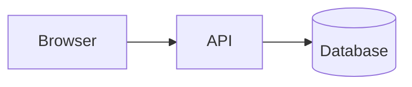
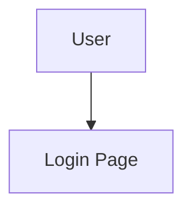

# Mermaid Docs

**Turn a Mermaid diagram into a guided walkthrough.**

[](https://www.npmjs.com/package/mermaid-docs)
[](https://www.npmjs.com/package/mermaid-docs)
[](https://github.com/bcage29/mermaid-docs/actions/workflows/ci.yml)
[](https://nodejs.org)
[](LICENSE)

Mark regions of the diagram as steps, describe each one in Markdown, and the viewer plays
them back a step at a time — highlighting the connections that step is about, the source
lines that draw them, and the prose that explains them.

```bash
npx mermaid-docs ./docs
```

<p align="center">
  
</p>

<p align="center">
  <a href="https://bcage29.github.io/mermaid-docs/"><b>Try the live demo →</b></a><br>
  <sub>The diagrams in <code>examples/</code>, read-only.</sub>
</p>

---

## Why

A Mermaid diagram shows the whole system at once. That is what makes it a good reference
and a poor explanation — a newcomer sees twenty arrows and no idea which three matter
first.

Mermaid Docs adds the narration track. The diagram stays an ordinary `.mmd` file that
renders anywhere, because the steps are written as Mermaid comments. What you get on top
is an order to read it in, and a viewer that dims everything you are not being told about
yet.

And because it ships [an MCP server](#mcp-server), you can hand the whole job to your
coding agent: *"document the auth flow diagram as a walkthrough."*

## Quick start

Two files with the same basename — the diagram, and its documentation:

```text
docs/
  hello.mmd
  hello.md
```

**`docs/hello.mmd`** — wrap the lines a step is about in `@step` comments:



**`docs/hello.md`** — one `##` heading per step, starting with the matching id:

```markdown
---
title: Hello
---

What this diagram shows, before the first step.

## request - The browser calls the API

A plain `GET`, no auth yet.

## store - The API writes to the database

One row per request, so a replay can be reconstructed later.
```

Then open the viewer:

```bash
npx mermaid-docs docs
```

It serves on a free port on `127.0.0.1` and opens your browser. Edits to either file
show up immediately — no restart.

## How it works

### Step markers

Markers go on their own line. Mermaid treats them as comments, so the diagram still
renders correctly in GitHub, VS Code, or anywhere else.



Regions may be **nested**, **overlapped**, or **repeated**. Repeating an id is how you
document something the diagram does more than once — an auth handshake before every
request, say — and every occurrence highlights together.

### Step documentation

The id is the first token after `##`; if the rest begins with `- `, that is the title.

```markdown
## user-entry - User arrives
```

Everything before the first `##` is the diagram overview, shown before step 1. Use `###`
or deeper for subsections inside a step body. Ordinary Markdown works throughout — code
blocks, tables, links.

Group steps into phases with an optional comment under the heading:

```markdown
## user-entry - User arrives
<!-- @phase Authentication -->
```

A phase is a label, not a hierarchy: the same phase can tag any steps, in any order.

## MCP server

The MCP server is the reason this is more than a viewer. It teaches your coding agent the
file format on connect — no `CLAUDE.md` to maintain — and gives it tools to create
diagrams, write and reorder steps, check that every arrow is covered, and link you
straight to the right step in the viewer.

### Claude Code

```bash
claude mcp add --scope project --transport stdio mermaid-docs -- \
  npx -y mermaid-docs mcp ./docs
```

Start Claude Code, approve the project server, and check it with `/mcp`.

### VS Code

Create `.vscode/mcp.json`:

```json
{
  "servers": {
    "mermaid-docs": {
      "type": "stdio",
      "command": "npx",
      "args": ["-y", "mermaid-docs", "mcp", "${workspaceFolder}/docs"]
    }
  }
}
```

Run **MCP: List Servers** from the Command Palette, start `mermaid-docs`, and approve it.

### Cursor, Windsurf, Zed, and other clients

Most other clients use the `mcpServers` key:

```json
{
  "mcpServers": {
    "mermaid-docs": {
      "command": "npx",
      "args": ["-y", "mermaid-docs", "mcp", "./docs"]
    }
  }
}
```

### Then ask

> Document the auth flow diagram as a walkthrough.

The server runs the viewer alongside it, so the agent can send you a link to the exact
step it just wrote.

<details>
<summary><b>Tools the agent gets</b></summary>

| Tool | What it does |
| --- | --- |
| `list_diagrams` | Every diagram in the workspace, with its step count |
| `get_diagram` | A diagram, its documentation, and its steps with line ranges |
| `list_connections` | Every arrow the diagram draws, and which step covers it |
| `create_diagram` | A new `.mmd` and its documentation file |
| `set_step` | Create or update a step, keeping marker and prose in sync |
| `delete_step` | Remove a step's marker pair and its section |
| `reorder_steps` | Set the walkthrough order |
| `validate_diagram` | Errors and coverage gaps |
| `get_viewer_url` | A link, optionally deep-linked to a diagram and step |

Plus a `document-diagram` prompt that walks a whole diagram end to end.

Prefer `set_step` over editing files directly: inserting a marker shifts every line
below it, so writing several steps by hand tends to corrupt the ranges.

</details>

## CLI

```bash
mermaid-docs <folder>                  # Open the viewer
mermaid-docs <folder> --lan            # Also serve on the local network
mermaid-docs mcp <folder>              # Start the MCP server and the viewer
mermaid-docs validate <folder>         # Validate every diagram
mermaid-docs init <diagram.mmd>        # Create its Markdown file
mermaid-docs set-step <diagram.mmd> --id token-issue --title "Token is issued" \
    --body "..." --start 11 --end 12
mermaid-docs delete-step <diagram.mmd> --id token-issue
```

Run `mermaid-docs --help` for every option.

### Validate in CI

`validate` exits `1` on errors, so it can guard a pull request. A step marked in the
diagram but never documented is a warning, not an error — as is an arrow no step covers.

```yaml
- run: npx -y mermaid-docs validate ./docs
```

```text
$ mermaid-docs validate examples
3 diagrams checked, 0 errors, 0 warnings
39/39 connections documented
```

## Keyboard

| Key | Action |
| --- | --- |
| `→` / `j` | Next step |
| `←` / `k` | Previous step |
| `Home` / `End` | First / last step |
| `` ` `` | Toggle the source panel |
| `f` | Toggle zoom-to-step |
| `F` | Toggle fullscreen |

## What works where

Connection highlighting — the blue arrows above — needs to know what a diagram draws, so
it covers **flowcharts** (`flowchart` / `graph`), **sequence diagrams**, and
**architecture diagrams** (`architecture-beta`). Every other Mermaid diagram type still
renders, and its **source lines still highlight**; the diagram itself is simply left
alone rather than partly emphasised.


### Limits

- Diagram file names must be unique within the scanned folder and its direct subfolders.
- Diagram files, sibling documentation, and directories below the workspace root must not
  be symbolic links. The selected root itself may be one. Path checks do not sandbox a
  workspace against concurrent changes by untrusted local processes.
- The viewer is read-only. Edit through your editor, the CLI, or the MCP tools.
- The server binds to `127.0.0.1`. `--lan` has no authentication — use it only on a
  network you trust.
- Requires Node.js 20 or newer.

## Privacy

The viewer identifies a workspace by its folder name, not its absolute path. MCP tool
responses omit local paths from filesystem errors while keeping validation feedback
actionable, and unexpected failures return a generic message to the agent — the details
go to stderr, never to the MCP protocol's stdout stream. CLI output and local HTTP errors
do keep full diagnostics, including paths, and MCP clients often capture stderr in their
logs.

This is not a redaction tool: diagram source, documentation, and titles are returned
whenever they are asked for. Review those files before sharing the viewer or pointing an
agent at them, and remember that replacing a screenshot does not remove older copies from
Git history.

## Contributing

Issues and pull requests are welcome — see [CONTRIBUTING.md](CONTRIBUTING.md) for the
development setup and the design decisions behind the viewer.

## License

[MIT](LICENSE) © Brennen Cage
