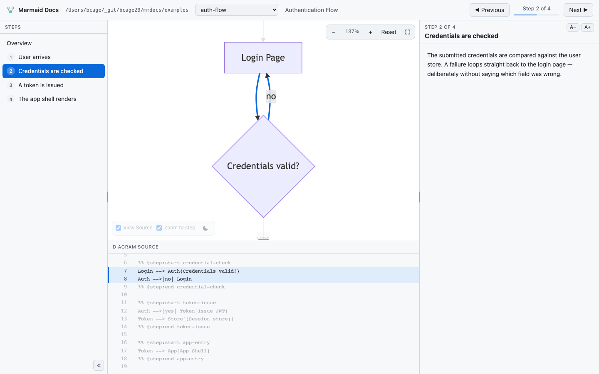
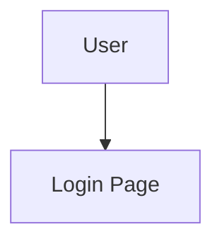

# Mermaid Docs

[](https://www.npmjs.com/package/mermaid-docs)

Turn Mermaid diagrams into step-by-step walkthroughs. Each step highlights the relevant
diagram connections, source lines, and documentation.

```bash
npx mermaid-docs ./docs
```

This opens a local viewer on a free port. Diagram changes appear automatically.



## Hosted demo

The [GitHub Pages demo](https://bcage29.github.io/mermaid-docs/) runs entirely in the
browser with the files in `examples/` bundled at build time. It is read-only and has no
live file watching; use the CLI when you want to browse a local workspace.

Pushes to `main` deploy the demo through `.github/workflows/ci.yml` only after all CI
checks pass. Pull requests do not deploy. In the repository
settings, set **Pages > Build and deployment > Source** to **GitHub Actions** once before
the first deployment.

## File format

Each diagram uses two files with the same name:

```text
docs/auth/
  auth-flow.mmd
  auth-flow.md
```

Add step markers to the Mermaid file:



Describe the matching step in the Markdown file:

```markdown
## user-entry - User arrives

The user hits `/login`. No session cookie is present yet.
```

The ID after `##` must match the marker ID. Content before the first `##` is
the diagram overview. Use `###` or deeper headings inside a step.

To group steps into phases, add an optional comment below the heading:

```markdown
<!-- @phase Authentication -->
```

Markers may be repeated, nested, or overlapped. Repeated IDs highlight together.

## MCP server

The MCP server teaches your coding agent the file format and gives it tools to
create diagrams, manage steps, check coverage, and open the viewer.

### VS Code

Create `.vscode/mcp.json` in your workspace:

```json
{
  "servers": {
    "mermaid-docs": {
      "type": "stdio",
      "command": "npx",
      "args": ["-y", "mermaid-docs", "mcp", "${workspaceFolder}/docs"]
    }
  }
}
```

Run **MCP: List Servers** from the Command Palette, start `mermaid-docs`, and approve
the server when prompted.

### Claude Code

Run this from your project root:

```bash
claude mcp add --scope project --transport stdio mermaid-docs -- \
  npx -y mermaid-docs mcp ./docs
```

Start Claude Code and approve the project server. Run `/mcp` to check its status.

Then ask your agent: `Document the auth flow diagram as a walkthrough.`

## CLI

```bash
mermaid-docs <folder>                  # Open the viewer
mermaid-docs <folder> --lan            # Share on your local network
mermaid-docs mcp <folder>              # Start MCP and the viewer
mermaid-docs validate <folder>         # Validate all diagrams
mermaid-docs init <diagram.mmd>        # Create its Markdown file
mermaid-docs set-step <diagram.mmd> --id token-issue --title "Token is issued" \
    --body "..." --start 11 --end 12
mermaid-docs delete-step <diagram.mmd> --id token-issue
```

Run `mermaid-docs --help` for all options. `validate` exits with code 1 for errors,
so it can be used in CI. Missing connection coverage is a warning.

## Keyboard

| Key | Action |
| --- | --- |
| `→` / `j` | Next step |
| `←` / `k` | Previous step |
| `Home` / `End` | First / last step |
| `` ` `` | Toggle the source panel |
| `f` | Toggle zoom-to-step |
| `F` | Toggle fullscreen |

## Limits

- Connection highlighting supports flowcharts, sequence diagrams, and architecture diagrams. Source
  highlighting works for all Mermaid diagram types.
- Diagram file names must be unique within the scanned folder and its direct
  subfolders.
- Diagram files, sibling documentation, and directories below the workspace root
  must not be symbolic links. The selected root itself may be a symbolic link.
  Path checks do not sandbox a workspace against concurrent changes by untrusted
  local processes.
- The viewer is read-only. Edit through the CLI, MCP tools, or your editor.
- The server binds to `127.0.0.1` by default. `--lan` has no authentication;
  use it only on a trusted network.

## Development

### Naming Compatibility

Use `mermaid-docs` for both the CLI command and MCP server configuration. The
former abbreviated command is no longer installed. Update scripts and MCP entries
that used it.

Environment variables use `MERMAID_DOCS_ROOT`, `VITE_MERMAID_DOCS_BASE`, and
`VITE_MERMAID_DOCS_STATIC`; the former abbreviated names are no longer read.
The browser preference namespace has also changed, so the saved theme resets once.

### Commands

```bash
npm install
npm run dev
npm run build
npm run build:pages
npm test
npm run test:e2e
```

Development requires Node.js 20 or newer. `npm run dev` documents `examples/`
by default; set `MERMAID_DOCS_ROOT` to use another folder. `build:pages` creates the static,
bundled-example version in `dist/web`; set `VITE_MERMAID_DOCS_BASE` when it will be served from
a subpath.

## License

MIT
